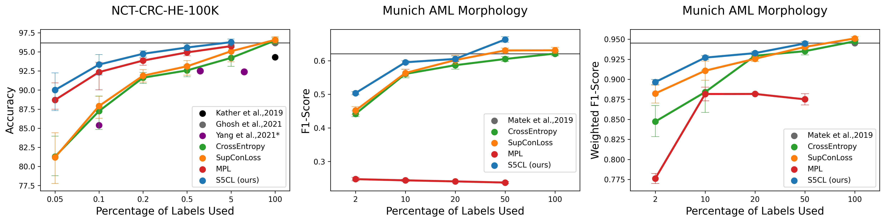
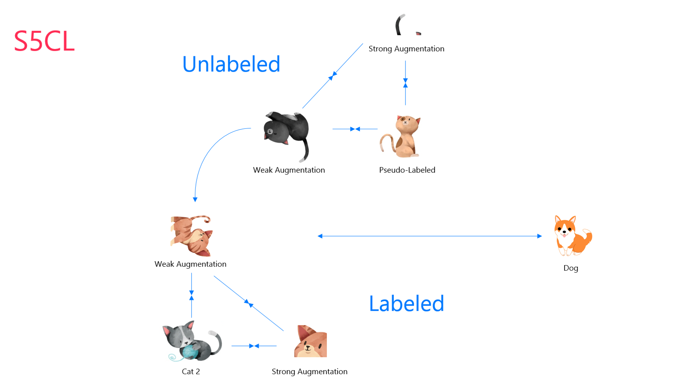

# S5CL: Supervised, Self-Supervised, and Semi-Supervised Contrastive Learning

S5CL unifies fully supervised, self-supervised, and semi-supervised learning into one single framework. It uses three contrastive losses for labeled, unlabeled and pseudo-labeled data to learn a hierarchy of feature representations. In particular, given an input, similar images and augmented views are embedded the closest, followed by different looking images, while images from different classes have the greatest distance.

## Overview

S5CL employs the following steps: 

* Apply weak augmentations (e.g., rotation) and strong augmentations (e.g., cropping) to labeled images. 

* Use a supervised contrastive loss to push feature representations of images from the same class towards each other and feature representations from other classes away. 

* If unlabeled images are available, augment them weakly and strongly as well. 

* Insert them into a self-supervised contrastive loss and treat each image as its own class. 

* Since we use the same embedding space for both labeled and unlabeled data, the unlabeled images will indirectly be moved to their corresponding labeled clusters. 

* After a few epochs, use the classifier to predict pseudo-labeles for the unlabeled images and replace the self-supervised contrastive loss with a semi-supervised contrastive loss. 

## Implementation

## Losses

To avoid that the contrastive losses on labeled and unlabeld images to be in conflict with each other, the hyperparameter which controls the cluster density should be different.

In our case we, use the SupConLoss with a single hyperparameters called the temperature. Its value should be higher for unlabeled images than for labeled images. Instead of this loss, it is also pososible to use this implementation with other loss functions.

